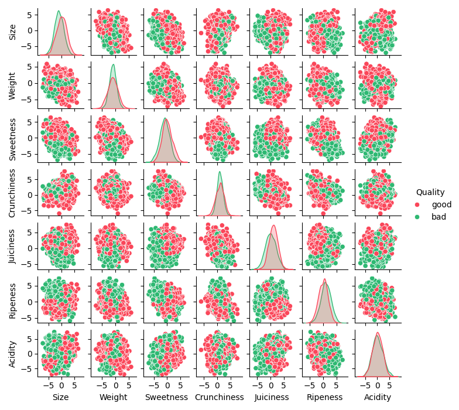
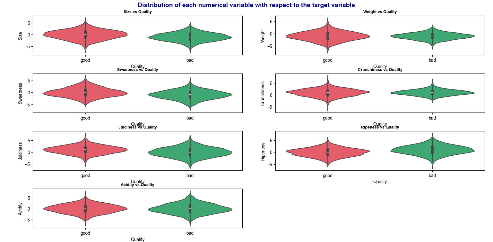
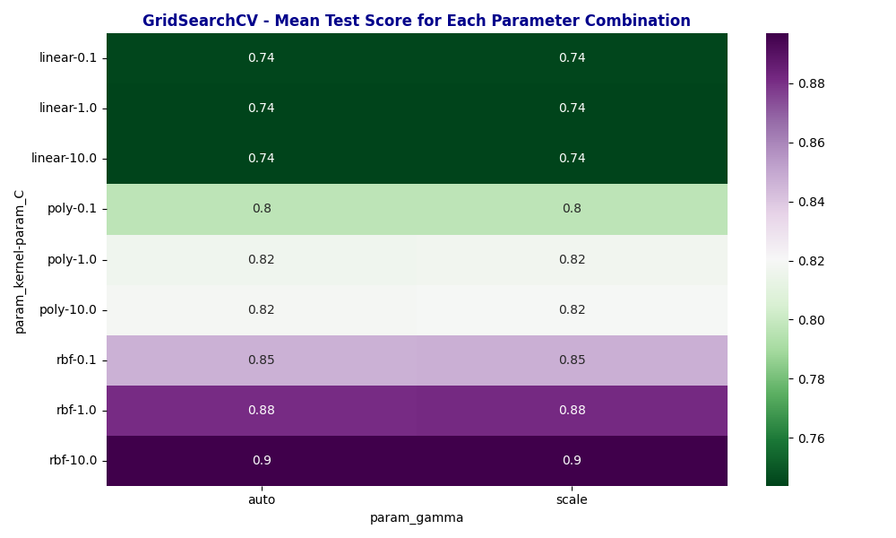

# Exploring Apple Quality :apple: : A Data-driven Journey:bar_chart:
<div style="text-align:right; font-size: 22px;font-weight: bold;">
10225501425 宋珊珊
</div>

***
## :one:引言
### 1.背景
水果的品质不仅仅是口感的问题，更是一个涉及多个因素的综合性议题。随着人们生活质量的提高以及对健康的日益重视，对水果品质的追求的成了消费者的共同心声。从大小、重量到酸甜度、松脆度再到多汁性、成熟度等等一系列指标，从多方面构成了苹果品质的复杂网络。

在本作业中，我将从数据的角度出发，展开一项关于苹果质量的数据分析，探讨苹果品质的关键因素，并展示它们之间的相互关系，以了解这个美味水果的多面貌 :yum:。

### 2.数据集
#### 来源：Kaggle
#### 数据集内容:
+ **A_id:** 每个水果的唯一标识符
+ **Size:** 水果的大小
+ **Weight:** 水果的重量
+ **Sweetness:** 水果的甜度
+ **Crunchiness:** 表明水果松脆度的质地
+ **Juiciness:** 水果的多汁程度
+ **Ripeness:** 果实成熟的阶段
+ **Acidity:** 水果的酸度水平
+ **Quality:** 水果的整体品质
#### 数据集大小：4000条

## :two:数据预处理
对数据集进行删除重复数据操作并检查是否有缺失值
```
#删除重复数据
data.drop_duplicates(inplace=True)
#检查是否有缺失值
print(data.isna().sum())
```
```
A_id           0
Size           0
Weight         0
Sweetness      0
Crunchiness    0
Juiciness      0
Ripeness       0
Acidity        0
Quality        0
dtype: int64
```

## :three:数据探索与特征工程
### 1.苹果品质分布


**通过饼图可以看出该数据集中好品质的苹果与坏品质的苹果数量均衡，这为模型训练提供了一个良好的基础，使得模型更容易学习，并产生对各个类别更平衡的预测，也使得模型算法的性能评估更为客观，不会受到样本不平衡导致的偏差影响。**

### 2.单变量分析 不同特征下苹果的分布

可以看到在每一种特征属性下，苹果的数量都是类正态分布的

### 3.不同特征之间的相对关系
#### :red_circle:成对特征图表


**从此图我们可以得知：**
+ **1）不区分苹果好坏时，苹果的各个特征之间相关性不大；**
+ **2）对于好品质的苹果，酸度与大小有一定的正相关关系而甜度与大小有一定的负相关关系；**
+ **3）对于坏品质的苹果，成熟度与甜度有一定的负相关关系；**
+ **4）总的来说，不论好苹果坏苹果，不同特征之间的相关性都不大，也就是说我们无法通过苹果的单一特征来判断苹果究竟是好品质的还是坏品质的**
#### :red_circle:特征相关性热力图


:arrow_up_small:从数值方面可以印证 1）的判断


:arrow_up_small:从数值方面可以印证 2）的判断


:arrow_up_small:从数值方面可以印证 3）的判断
#### :red_circle:小提琴图
每个特征变量相对于目标变量（苹果品质）的分布

可以看到除了在大小、甜度、多汁度三方面，好苹果的中位数要略高于坏苹果，其他的特征下，好坏苹果差别不大。由此也可以看出我们无法通过苹果的单一特征来判断其品质

## :four:数据建模与结果评估
将数据分成两个部分：训练集（80%）和测试集（20%）。训练集将用于模型的训练，而测试集将用于评估模型的性能。
```
#划分数据集，80%用于训练，20%用于测试
train_df, test_df = train_test_split(data, test_size=0.2, random_state=42)
#选择用于预测的特征列
feature_columns=['Size', 'Weight', 'Sweetness', 'Crunchiness', 'Juiciness', 'Ripeness', 'Acidity']
#训练集的输入特征
X_train = train_df[feature_columns]
#测试集的输入特征
X_test = test_df[feature_columns]
#训练集的标签
y_train = train_df['Quality']
#测试集的标签
y_test = test_df['Quality']
#数据标准化
scaler = StandardScaler()
X_train_scaled = scaler.fit_transform(X_train)
X_test_scaled = scaler.transform(X_test)
```
 以准确率 (Accuracy)、精度 (Precision)、召回率 (Recall)、F1分数 (F1 Score)、ROC曲线 (Receiver Operating Characteristic curve)为评估指标比较不同类型的分类器评估模型的性能
```
classifiers = [
    SVC(probability=True,random_state=42),
    LogisticRegression(random_state=42),
    DecisionTreeClassifier(random_state=42),
    RandomForestClassifier(random_state=42),
    GaussianNB(),
    KNeighborsClassifier()
]
```
得到如下结果
```

Classifier: SVC
Accuracy: 0.91
Confusion Matrix:
[[362  39]
 [ 35 364]]
Classification Report:
              precision    recall  f1-score   support

           0       0.91      0.90      0.91       401
           1       0.90      0.91      0.91       399

    accuracy                           0.91       800
   macro avg       0.91      0.91      0.91       800
weighted avg       0.91      0.91      0.91       800

----------------------------

Classifier: LogisticRegression
Accuracy: 0.75
Confusion Matrix:
[[303  98]
 [ 99 300]]
Classification Report:
              precision    recall  f1-score   support

           0       0.75      0.76      0.75       401
           1       0.75      0.75      0.75       399

    accuracy                           0.75       800
   macro avg       0.75      0.75      0.75       800
weighted avg       0.75      0.75      0.75       800

----------------------------

Classifier: DecisionTreeClassifier
Accuracy: 0.81
Confusion Matrix:
[[324  77]
 [ 75 324]]
Classification Report:
              precision    recall  f1-score   support

           0       0.81      0.81      0.81       401
           1       0.81      0.81      0.81       399

    accuracy                           0.81       800
   macro avg       0.81      0.81      0.81       800
weighted avg       0.81      0.81      0.81       800

----------------------------

Classifier: RandomForestClassifier
Accuracy: 0.90
Confusion Matrix:
[[356  45]
 [ 38 361]]
Classification Report:
              precision    recall  f1-score   support

           0       0.90      0.89      0.90       401
           1       0.89      0.90      0.90       399

    accuracy                           0.90       800
   macro avg       0.90      0.90      0.90       800
weighted avg       0.90      0.90      0.90       800

----------------------------

Classifier: GaussianNB
Accuracy: 0.76
Confusion Matrix:
[[312  89]
 [101 298]]
Classification Report:
              precision    recall  f1-score   support

           0       0.76      0.78      0.77       401
           1       0.77      0.75      0.76       399

    accuracy                           0.76       800
   macro avg       0.76      0.76      0.76       800
weighted avg       0.76      0.76      0.76       800

----------------------------

Classifier: KNeighborsClassifier
Accuracy: 0.90
Confusion Matrix:
[[356  45]
 [ 37 362]]
Classification Report:
              precision    recall  f1-score   support

           0       0.91      0.89      0.90       401
           1       0.89      0.91      0.90       399

    accuracy                           0.90       800
   macro avg       0.90      0.90      0.90       800
weighted avg       0.90      0.90      0.90       800

----------------------------
```
可视化上述常用分类算法在苹果好坏分类任务中 Accuracy、Precision、Recall、F1-score 的值

可以看到支持向量机在各个评估指标下都表现较好

**roc曲线**

**综合来看，SVC分类算法在这些指标中表现较好，可以作为苹果好坏分类任务的首选模型**

可视化 SVC 对于网格搜索各个参数经过交叉验证之后的准确率得到下图

在进行参数网格搜索后，观察到在 gamma='auto' 或 gamma='scale' 和 kernel='rbf' 以及 C=10.0 的情况下取得了最大的数值，模型性能最好。

## :five:总结与展望
#### 总结
对苹果品质数据进行分析以后，可以得出一些关键结论
1. **多特质判断**：苹果品质的好坏不能简单地通过单一特质来判断。相反，多个特质，包括大小、重量、甜度、酸度、成熟度、多汁度、松脆度等等，共同影响着苹果的品质。
2. **SVC分类算法**：评估了多种分类算法后，发现支持向量机（SVC）是对苹果好坏进行分类的首选模型。SVC在处理多特征问题时表现出色，有效地捕捉了不同特质之间的复杂关系，提供了可靠的分类性能。
3. **模型准确性**：模型在训练集和测试集上都取得了令人满意的准确性，表明它能够对新的苹果样本进行有效的分类。
#### 展望
尽管得出了一些关键结论，但仍然存在一些方向可以进一步探索与改进
1. **特质权重分析**：进一步研究不同特质对苹果品质的相对重要性，进一步优化模型。
2. **数据扩充**：考虑增加样本的多样性和数量，进一步提高模型的泛化能力。
3. **其他模型比较**：在本次数据分析中只比较了6种分类算法，尝试比较其他分类模型的性能，看是否有更适合苹果品质分类任务的算法。