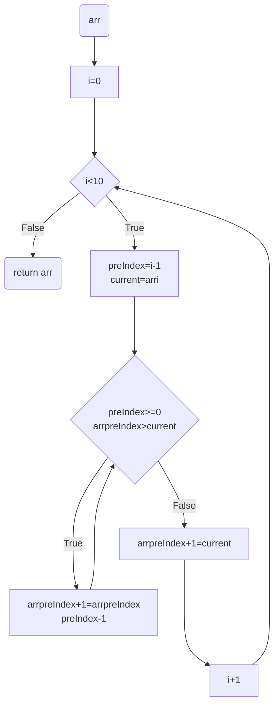

# 数据科学与工程导论
## 第四章
### 第3题
插入排序是将待排数组抽象划分成两个序列：一个是有序序列，一个是无序序列。通过构建有序序列，对于未排序序列中的数据，在已排序序列中从后向前扫描，找到相应的位置并插入
下图为流程图（假设数组长度为10）

```mermaid
graph TB
A(arr)-->B[i=0]
B[i=0]--->C{i<10}
C{i<10}--False-->D(return arr)
C{i<10}--True-->E[preIndex=i-1\ncurrent=arri]
E[preIndex=i-1\ncurrent=arri]--->F{preIndex>=0\narrpreIndex>current}
F{preIndex>=0\narrpreIndex>current}--False-->G[arrpreIndex+1=current]
F{preIndex>=0\narrpreIndex>current}--True-->H[arrpreIndex+1=arrpreIndex\npreIndex-1]
H[arrpreIndex+1=arrpreIndex\npreIndex-1]--->F{preIndex>=0\narrpreIndex>current}
G[arrpreIndex+1=current]--->I[i+1]
I[i+1]--->C{i<10}
```
### 第4题
希尔排序的时间复杂度是O(n^1.5^),空间复杂度是O(1)
